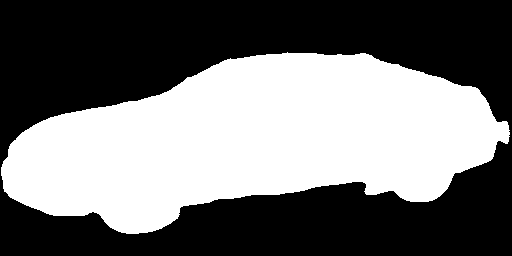

# unet.cpp

U-Net from scratch in C++. Based on [milesial/Pytorch-UNet](https://github.com/milesial/Pytorch-UNet).

 | 

## Instructions

1. Download and convert weights

```
python convert.py
```

Downloaded weights come from [here](https://github.com/milesial/Pytorch-UNet?tab=readme-ov-file#pretrained-model).
Weights are converted to [llama.c format](https://github.com/karpathy/llama2.c/blob/master/export.py) as `weights.bin`.

2. Build U-Net

```
make unet
```

3. Run U-Net

```
./unet [input] [output]
```

Input must be an image in [PPM](https://netpbm.sourceforge.net/doc/ppm.html) format with spatial dimensions powers of 2.
Note that the current implementation of the PPM reader is limited; however, it has worked successfully on files created
with [ImageMagick](https://imagemagick.org/).

The output will be saved in [PGM](https://netpbm.sourceforge.net/doc/pgm.html) format.

**Example**

A sample valid PPM file is included as `car.ppm` (created with ImageMagick from `car.png` via `convert car.png car.ppm`).

```
./unet car.ppm mask.pgm
```
